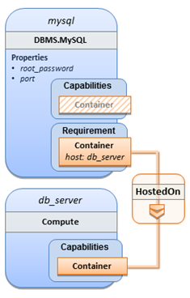

# Introduction to TOSCA

## WHAT IS TOSCA?

TOSCA, short for Topology and Orchestration Specification for Cloud Applications, is a template language developed recently by OASIS, a standards organization, to describe the topology of a cloud and the applications running on it.

## WHAT IS IT GOOD FOR?

Put simply, you would use TOSCA to describe how an application would be deployed to a cloud. This includes instructions on how to deploy all the application's components, their individual requirements, their dependencies, and also the relationships between them. It is a language created to facilitate orchestration, comparable in scope to OpenStack Heat or Amazon CloudFormation.

A distinguishing characteristic of TOSCA is that it was designed to be used with any cloud provider or platform, regardless of underlying technology. When TOSCA is offered by the platform, a single TOSCA template could be used to launch the same application on different providers - without modification!

## A LITTLE HISTORY

TOSCA 1.0 was approved in early 2014, a project sponsored by leading companies such as IBM, RedHat, Huawei, and others. Its goal is to provide a platform-agnostic orchestration tool for cloud administrators, one that can describe any topology, workflow, and policy across different cloud implementations:


## TOSCA SIMPLE PROFILE IN YAML

The original TOSCA specification describes a Domain Specific Language in XML, meant to be machine and human readable. However, anyone who has been tasked with editing XML knows that though it is certainly readable, the jury's still out on whether it is actually writable by humans.

Luckily for us humans, the TOSCA Simple Profile in YAML 1.0 is in the final stages of approval. YAML is a more human-friendly language than XML, with a syntax much easier to read and edit. Thus, the TOSCA Simple Profile in YAML version aims to be more accessible and concise, not least of which to speed the adoption of TOSCA itself.

You can find Draft 05 of the Simple Profile specification [here](http://docs.oasis-open.org/tosca/TOSCA-Simple-Profile-YAML/v1.0/csprd02/TOSCA-Simple-Profile-YAML-v1.0-csprd02.html).

## TOSCA RELATIONSHIP DIAGRAMS

But it's not all XML and YAML. In order to describe any application in TOSCA terms, you can draw a diagram like this:


This diagram has 5 nodes, represented by square boxes. (Here, the term "node" describes components of the topology, not physical or virtual computers.) Every node has a name and a type, the latter of which we'll discuss in a subsequent chapter.

Nodes also have relationships with each other: connections and containment. You can see both of these types of relationships in the diagram as well. The ones of type "Contained-In" are implicit, where one node is contained in another, whereas "Connected-To" are explicit, wherever arrows are drawn.

## A SIMPLE EXAMPLE

And finally, here's a YAML example (taken from the Simple Profile specification itself), to make all this a little clearer. This particular template models the deployment of a MySQL instance on a database server, using the DBMS.MySQL node type. It expects a root password and service port as inputs at deployment time:

```YAML
tosca_definitions_version: tosca_simple_yaml_1_0
description: Template for deploying a single server with MySQL software on top.

topology_template:
  node_templates:
    mysql:
      type: tosca.nodes.DBMS.MySQL
      properties:
        root_password: { get_input: my_mysql_rootpw }
        port: { get_input: my_mysql_port }
      requirements:
        - host: db_server

    db_server:
      type: tosca.nodes.Compute
```
This is what the equivalent diagram looks like:

